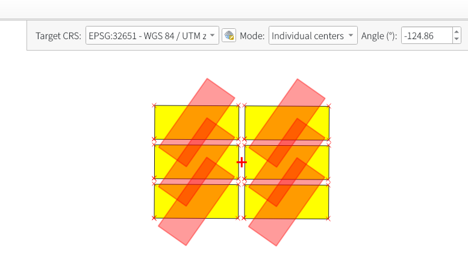

# Better Rotate Plugin for QGIS

A small QGIS plugin that extends the built-in rotate feature tool.

[Better Rotate — QGIS Python Plugins Repository](https://plugins.qgis.org/plugins/better_rotate_plugin/)

## Features

1. **Rotation center**
   - **Group center**: rotate all selected features around a single shared center. You can set a custom center with `Ctrl + Left Click`.
   - **Individual centers**: rotate each feature around its own centroid.

2. **Rotate in a chosen CRS**
   - Transform geometries from the layer CRS to the selected Target CRS.
   - Perform rotation in the Target CRS.
   - Transform back to the layer CRS and write the edited geometries.
   - This helps avoid distortion results when rotating directly in a geographic CRS (lat/lon).
